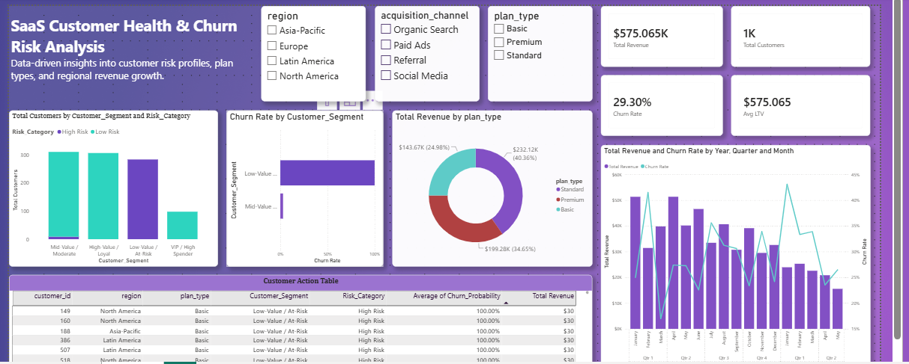

# SaaS Customer Churn Analytics

An end-to-end data analytics project: synthetic SaaS subscription data →
SQL feature engineering → Python ML (segmentation + churn prediction) →
interactive Power BI dashboard.



## Business problem

A subscription SaaS business wants to know **who is likely to churn, why,
and where revenue is concentrated**, so retention efforts can be targeted
instead of broad-based. This project simulates that data end-to-end and
builds the analytics stack a business analyst would deliver: a clean data
model, engineered features, a predictive model, and an executive dashboard.

## Results at a glance

| Metric | Value |
|---|---|
| Customers analyzed | 1,000 |
| Total revenue | $575.06K |
| Overall churn rate | 29.30% |
| Avg. customer LTV | $575.06 |

- Highest-risk cohort: **Basic-plan** customers in the **Low-Value / At-Risk**
  segment — several flagged at ~100% predicted churn probability.
- Revenue split: **Standard** 40.4% · **Premium** 34.7% · **Basic** 25.0%.
- Full write-up: [`docs/executive_summary.pdf`](docs/executive_summary.pdf)

## Tech stack

`SQLite` `SQL (CTEs, window functions)` `Python (pandas, scikit-learn)` `Power BI / DAX`

## Project structure

```
saas-customer-churn-analytics/
│
├── data/
│   ├── raw_customer_data.csv          <- Denormalized join of the raw source tables
│   └── cleaned_customer_data.csv      <- Cleaned + RFM-engineered, ready for Power BI
│
├── sql/
│   ├── 01_schema_setup.sql            <- Database tables & constraints
│   ├── 02_data_cleaning.sql           <- SQL transformations & handling nulls
│   └── 03_churn_analysis_queries.sql  <- SQL queries calculating Churn, LTV, & Segments
│
├── python/
│   ├── eda_and_preprocessing.ipynb    <- Data cleaning & EDA
│   └── churn_prediction_model.ipynb   <- RFM scoring, K-Means segmentation, Random Forest churn model
│
├── power_bi/
│   ├── SaaS_Customer_Health.pbix      <- Main Power BI report
│   └── dax_measures.md                <- Documented DAX measures
│
├── docs/
│   ├── dashboard_preview.png          <- Dashboard screenshot
│   └── executive_summary.pdf          <- 1-page summary report
│
├── 01_generate_data.py                <- Standalone script: generates churn_analytics.db
├── 02_sql_feature_engineering.py      <- Standalone script: SQL → customer_rfm_churn_data.csv
├── 03_ml_segmentation_churn.py        <- Standalone script: ML → final_customer_analytics.csv
└── README.md
```

## Pipeline

1. **Generate / ingest data** (`01_generate_data.py`) — builds a SQLite
   database (`customers`, `subscriptions`, `transactions`) with realistic
   signup dates, plans, regions, acquisition channels, and monthly billing
   transactions.
2. **Clean & engineer features in SQL** (`sql/02_data_cleaning.sql`,
   `sql/03_churn_analysis_queries.sql` / `02_sql_feature_engineering.py`) —
   de-duplicates records, then uses CTEs and window functions to compute
   Recency, Frequency, Monetary value (RFM), tenure, churn label, and
   region-level revenue benchmarks.
3. **Model in Python** (`python/`) —
   - `eda_and_preprocessing.ipynb`: loads the raw DB, cleans it, explores
     distributions and correlations.
   - `churn_prediction_model.ipynb`: RFM scoring (1–5 scale), K-Means
     clustering into 4 business segments (Low-Value/At-Risk, Mid-Value/
     Moderate, High-Value/Loyal, VIP/High Spender), and a Random Forest
     classifier predicting churn probability, output as `Risk_Category`
     (Low / Medium / High Risk).
4. **Visualize in Power BI** (`power_bi/SaaS_Customer_Health.pbix`) — KPI
   cards, churn-by-segment, revenue-by-plan, a revenue/churn trend over
   time, and a drill-down customer action table filtered by region,
   acquisition channel, and plan.

## How to reproduce

```bash
pip install pandas numpy scikit-learn

# 1. Generate the SQLite database
python 01_generate_data.py

# 2. Run SQL feature engineering -> data/cleaned_customer_data.csv
python 02_sql_feature_engineering.py

# 3. Run segmentation + churn model -> data/final_customer_analytics.csv
python 03_ml_segmentation_churn.py

# 4. Open power_bi/SaaS_Customer_Health.pbix in Power BI Desktop
#    and point it at data/final_customer_analytics.csv
```

Or work through `python/eda_and_preprocessing.ipynb` and
`python/churn_prediction_model.ipynb` interactively in Jupyter.

## Author

Ashutosh Malhotra — Data Analyst | Forage Data Analytics (Deloitte) & GenAI/Data Analysis
(Tata iQ) simulations | SQL | Python | PowerBI 
[LinkedIn](https://www.linkedin.com/in/ashutosh-malhotra-810396327)
